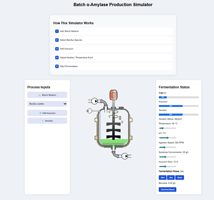
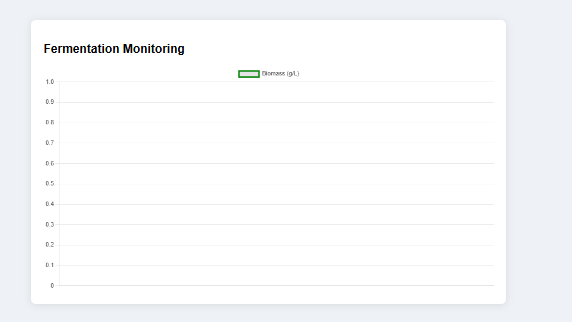
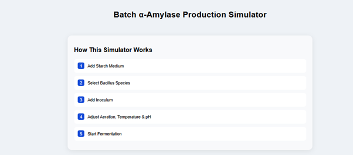
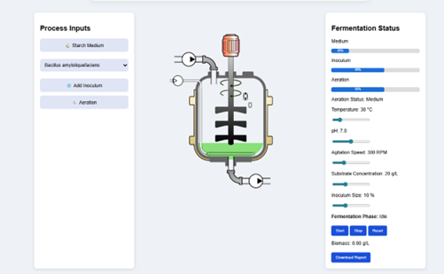
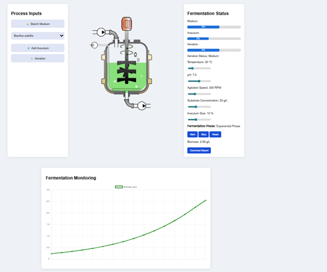
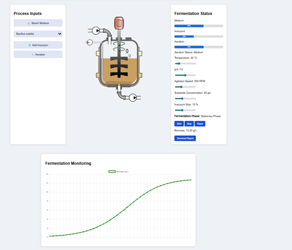
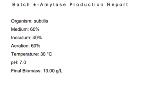

### Steps to work the simulator 

1. Users can open the simulator window from the virtual bioreactor simulation experiment. The GUI provides an interactive page foe Batch α-Amylase Production Simulator. The screen was displayed with a central bioreactor (fermenter) model, process inputs panel (left), fermentation status panel (right) and a fermentation Monitoring graph (bottom).

  

&nbsp;

  

&nbsp;

&nbsp;
  
2. Users can go through the workflow instructions provided at the top of the page-How This Simulator Works. And it defines correct operational order for the simulation.

  

&nbsp;

3. In the Process Inputs panel, provide different selection tabs like the Starch Medium button, Select Bacillus (dropdown selection with Bacillus subtilis and Bacillus amyloliquefaciens), Add Inoculum button, and Aeration button. These parameters determine the initial batch-wise fermentation setup.

&nbsp;

4. In the central panel, users can observe a stirred tank fermenter with Agitator blades, Inlet/outlet connections, and Liquid starch medium inside, which visually represents the batch fermentation system.

&nbsp;

5. Also, the users can monitor the fermentation status panel on the right side, which includes the parameters like medium status, Inoculum level, Aeration state, Temperature, pH, Agitation speed, Substrate concentration, Fermentation phase, biomass, and enzyme output.

&nbsp;

6. Also, the fermentation monitoring graph at the bottom displays the changes in parameters, i.e. enzyme production over time and provides a quantitative tracking of the fermentation process.

  

&nbsp;

7. To begin the simulation, click on the starch medium button from the process input panel and the fermenter is filled with substrate, providing the carbon source for enzyme production.

&nbsp;

8. Then select the microbial species like Bacillus subtilis or Bacillus amyloliquefaciens from the dropdown menu. The figure shows that the chosen microorganism is Bacillus subtills.

  

&nbsp;

9. Click “Add Inoculum” to introduce microbial cells into the medium. This initiates microbial growth inside the bioreactor.

&nbsp;

10. Click “Aeration” to supply oxygen. This supports aerobic metabolism and enzyme production.

&nbsp;

11. Monitor the fermentation status parameters on the right panel for Medium, Inoculum, Aeration levels percentage, Temperature (e.g., 30°C), pH (e.g., 7.0), Agitation speed (e.g., 300 RPM), Substrate concentration and inoculum size, which defines the operating conditions of batch fermentation.

&nbsp;

12. Click on the Start button to begin the fermentation simulation, and the system enters the Exponential Phase, indicating active microbial growth. Also, the GUI allows the users to monitor biomass production from the fermentation monitoring graph, which indicates biomass increases over time, microbial growth and enzyme production efficiency.

&nbsp;

13. After sufficient time, from the fermentation status panel, users can observe that the system has entered the stationary phase where the microbial growth has slowed or stabilised.

  

&nbsp;      

14. The user can analyse the change of colour in the bioreactor where the medium inside the fermenter becomes dense or turbid, indicating high cell concentration and accumulation of metabolic products.

&nbsp;

15. Observe the biomass levels, which increased significantly to a value of app 13g/Land and reached a maximum level. (from the report provided in the simulation)

  

&nbsp;

16. From the fermentation monitoring graph, users can observe a plateau curve after exponential growth, which indicates the transition of growth to stabilization. The stationary phase represents the optimal production phase in batch fermentation. When growth stabilizes the enzyme production yield is at the highest value.

&nbsp;

17.	Also, the GUI provide control buttons to stop, reset and download the report from the experiment.

&nbsp;

&nbsp;
