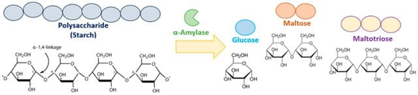
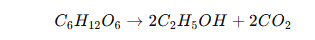
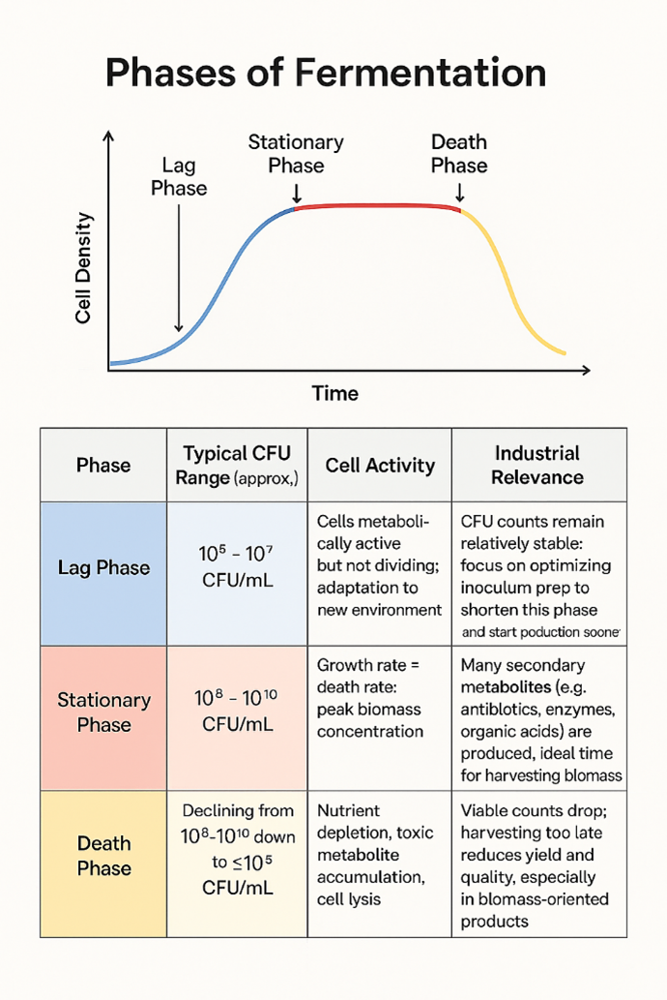
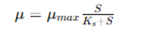
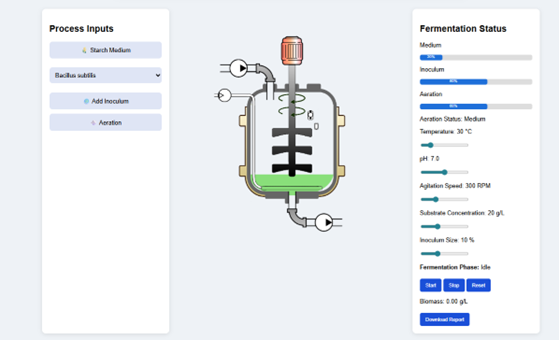

Alpha amylase is one of the significant hydrolytic enzymes used in various biotechnological industries, which plays a key role in catalyzing the hydrolysis reaction of starch to produce maltose and glucose. The enzyme catalyzes the endo-cleavage of α-1,4-glycosidic bonds present in starch and results in the formation of oligosaccharides like maltose, maltotriose, and glucose (Fig.1). Due to its catalytic efficiency, α-amylase has been widely used in the bioconversion of starch to fermentable sugars. This catalytic role of α-amylase explains its wide use in different sectors of industry. In industrial biotechnology, α-amylase is employed in a variety of industrial processes such as food production, designing textiles, pharmaceutical development, and biofuel development, particularly starch-based biofuel. The industrial significance of α-amylase is further supported by its operational efficiency even in varying physicochemical conditions such as temperature and pH, which are critical in industrial processes. However, the increased demand for α-amylase in industries is not only due to the catalytic activity of the enzyme, but also to the high turnover number and the facility for process scale-up. The microbial fermentation process has been recognized as the major process to produce α-amylase, especially by microorganisms such as Bacillus subtilis and Bacillus amyloliquefaciens. These microorganisms are the first choice to produce α-amylase due to their high growth rates and efficient utilization of the substrates. The extracellular secretion of the enzyme by these microorganisms is of major significance as it eliminates the need for expensive operations for cell disruption.

&nbsp;

  
   
  <i>Figure 1. Hydrolysis of starch by alpha amylase to produce glucose, maltose and maltotriose 
  Source: https://www.researchgate.net/publication/394068678_Characterization_of_a_Thermostable_a-Amylase_from_Bacillus_licheniformis_104K_for_Industrial_Applications/figures?lo=1 
</i>

&nbsp;

### Microbial Fermentation

Fermentation is a metabolic process that mainly takes place in the absence of oxygen (anaerobic environment), although in industrial biotechnology, the term encompasses both aerobic and anaerobic processes under controlled conditions. During fermentation, carbohydrates are converted into simpler substances like alcohols, organic acids, and gases, releasing energy for the survival of the microbes. One of the classical examples of fermentation is the conversion of glucose into ethanol and carbon dioxide, which can be represented by the following biochemical reaction.

&nbsp;

  
   
  

&nbsp;
Microbial fermentation is a biochemical process in which microorganisms transform organic substances into simpler forms by a series of metabolic pathways accompanied by the production of energy and useful secondary metabolites. Microorganisms such as bacteria, fungi, and yeast are the primary biological agents that act as catalysts for the process of fermentation due to their high growth rate and genetic flexibility. These microorganisms obtain organic substances such as carbohydrates, e.g., glucose and starch, and convert them into the desired product by a series of biochemical reactions that involve the action of enzymes. The process is usually performed in a controlled environment called a bioreactor, in which the key parameters for the process are optimized to produce the desired product. In addition, the fermentation process is also controlled by mass transfer and transport phenomena, especially oxygen transfer during aerobic fermentation. The balance between the amount of oxygen supplied to the culture, i.e., the oxygen transfer rate (OTR), and the amount of oxygen consumed by the culture, i.e., the oxygen uptake rate (OUR), is important. If the oxygen transfer rate is low, it can limit the rate of respiration, hence lowering the yield, and excessive agitation can lead to cell death.

&nbsp;

### Types of Fermentation

Microbial fermentation can be classified in many ways depending on factors like mode of operation, requirement of oxygen, and type of product. The simulator in the virtual lab mainly focuses on the batch-wise alpha amylase production.

#### Based on the Mode of Operation

a) **Continuous Fermentation**: In the continuous mode of fermentation, fresh medium is continuously supplied into the bioreactor while the culture broth is simultaneously removed to maintain a constant culture volume. This process allows the system to maintain a steady state in the bioreactor. However, the continuous system offers high productivity and resource utilisation efficiency; the process requires precise control and is more prone to contamination and genetic instability of the microbes.

b) **Fed-Batch Fermentation**: Fed-batch fermentation is a technique in which nutrients are supplied to the fermentation in a controlled manner. This technique helps in maintaining optimal substrate concentration, which helps in overcoming substrate inhibition and achieving a better yield of products. It is particularly used in those fermentations in which a high concentration of substrate may be inhibitory. Fed batch fermentation is particularly used in industrial enzyme production and recombinant protein synthesis.

c) **Batch Fermentation**: Batch fermentation is a type of closed system bioprocess in which all the necessary nutrient requirements, including the carbon source, nitrogen source, mineral requirements, and growth factors, are added to the bioreactor at the beginning of the process. Once the process has been inoculated with the appropriate type of microorganisms, like Bacillus subtilis or Bacillus amyloliquefaciens, the process continues without any further additions of nutrient sources, apart from controlled gas exchange or aeration. The process takes place in a specific set of environmental conditions, and the culture of the microbes develops dynamically as the nutrient sources are consumed and metabolic byproducts are produced.

The kinetics of batch fermentation are inherently time-dependent, and microbial growth exhibits a characteristic growth curve with distinct phases of lag, exponential, stationary, and death phases (Fig.2). In the lag phase, the cells adapt to the new environment, and metabolic pathways are initiated. Then, in the exponential phase, the rate of cell division is high, and substrate utilization is at a maximum. In the case of an enzyme production system, like α-amylase fermentation, the production of α-amylase is growth-associated or partially growth-associated, and it is related to the exponential phase and early stationary phase. As the system transitions into the stationary phase, nutrient or substrate limitations and the accumulation of inhibitory metabolites can result in a peak or a decline in α-amylase enzyme production.

&nbsp;

  
   
  <i>Figure 2. Diagram illustrating different phases of bacterial growth curve. 
  Source: https://www.amergingtech.com/post/fermenter-phase  
</i>

&nbsp;

From a biochemical perspective, batch fermentation is influenced by microbial growth kinetics and substrate utilization kinetics, typically defined by kinetic models such as the Monod equation. The equation is a fundamental model in microbial kinetics, which addresses the relationship between specific growth rate and substrate concentration. This equation is commonly employed in fermentation engineering to simulate microbial responses in different processes, such as batch, fed batch, and continuous cultures. It is represented as:  

&nbsp;

  
   
  <i> μ (Specific growth rate): Rate of increase of biomass per unit biomass (h⁻¹) 	μₘₐₓ (Maximum specific growth rate): Highest possible growth rate under optimal conditions S (Substrate concentration): Concentration of limiting nutrient (e.g., starch/glucose) 	Kₛ (Half-saturation constant): Substrate concentration at which μ = μₘₐₓ / 2 
</i>

&nbsp;

Thus, the equation defines how microbial growth is limited by substrate availability. However, a critical limiting factor in batch processes is that in the absence of substrate addition, substrate concentration is depleted over time, affecting metabolic activity in the system. At the same time, other limiting factors such as oxygen, pH, and metabolic byproducts can also impact system performance. Thus, in batch processes, efficiency is typically influenced by initial medium composition and control of environmental parameters.

&nbsp;

For aerobic batch fermentation processes, e.g., α-amylase fermentation using Bacillus sp, oxygen transfer becomes a critical rate-limiting factor. Oxygen transfer rate and oxygen uptake rate must be in balance to keep the system metabolically active. Agitation in terms of RPM and aeration rate has a direct impact on the volumetric mass transfer coefficient (kLa). Oxygen availability, in turn, affects the metabolism of the cells, ATP generation, and hence the enzyme productivity. Batch fermentation is limited by lower volumetric productivity compared to fed batch and continuous fermentation. The requirement of downtime between cycles to clean, sterilize, and re-inoculate reduces the system efficiency. The vlab simulator (Fig.3) provides a controlled framework of batch fermentation to observe the effect of various parameters, like temperature, pH, aeration, agitation speed, substrate concentration, and inoculum size, on microbial growth and α-amylase production.

&nbsp;

  
   
  <i>Figure 3. Virtual bioreactor for the batch-wise production of alpha amylase 
</i>

&nbsp;

&nbsp;

